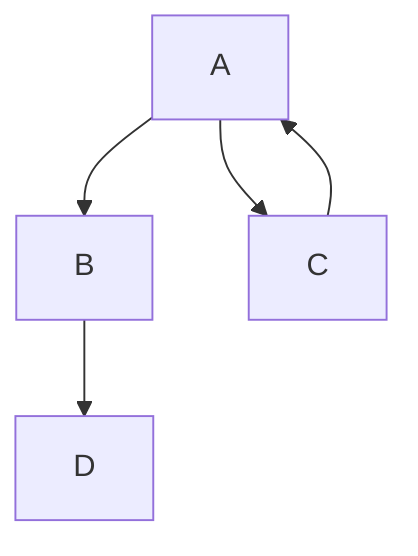

<p align="center">

</p>

## Abstract



Here are a few tips for learning Neovim.

* Ensure keybindings are discoverable, logically grouped, and don't conflict
* Create a cheatsheet to remind us of the things that are not often used or those that can help us whilst learning

## Plugins

The main way to customise Neovim is with plugins, either build your own configuration or
a good idea to begin with is to use a pre-packaged collection such as [Lunarvim](https://github.com/lunarvim/lunarvim).

Also, see my article on [Extending Neovim](https://roobert.github.io/2022/12/03/Extending-Neovim/).

## Default Keybindings

First, find a cheatsheet for your keyboard layout from [here](https://github.com/mattmc3/neovim-cheatsheet).

It's not critical to learn all the keybindings immediately, however, it is a good idea
to try and learn movement with `hjkl`.

Keep a copy of the keyboard cheatsheet handy for reference.


## Vim Tutor

Run `:Tutor` to go through a set of lessons that'll introduce you to the most common
features of Neovim.


## Discoverability with the Which-Key Plugin

If not using Lunarvim, install the `which-key` plugin.

```
lvim.builtin.which_key.mappings["f"] = { "<CMD>Telescope buffers<CR>", "Buffer list" }
lvim.builtin.which_key.mappings["t"] = { "<CMD>TroubleToggle document_diagnostics<CR>", "Trouble" }
lvim.builtin.which_key.mappings["-"] = { "<Plug>(toggle-lsp-diag-vtext)", "Toggle Diagnostics" }
lvim.builtin.which_key.mappings["+"] = { "<CMD>Copilot toggle<CR>", "Toggle Copilot" }
```

The following screenshot shows the output of `which-key` when a key is pressed and a
time has elapsed:


## Improving with the Cheatsheet Plugin

The cheatsheet plugin (not to be confused with the keyboard shortcuts cheatsheet) is a
great way to keep and refer to notes and reminders that you can use to improve your Neovim
knowledge.

Install the plugin by updating `~/.config/lvim/config.lua`:
```lua
lvim.plugins = {
  -- place to store reminders and rarely used but useful stuff
{ 'sudormrfbin/cheatsheet.nvim',
    requires = {
      { 'nvim-telescope/telescope.nvim' },
      { 'nvim-lua/popup.nvim' },
      { 'nvim-lua/plenary.nvim' },
    },
    config = function()
      require('cheatsheet').setup {
        -- hide bundled cheatsheets to make our own notes more easy to reference
        bundled_cheatsheets = false,
        bundled_plugin_cheatsheets = false,
        include_only_installed_plugins = false,
        location = 'bottom',
        keys_label = 'Keys',
        description_label = 'Description',
        show_help = true,
      }
    end,
  },
}
```

Create a `~/.config/nvim/cheatsheet.txt` and symlink it if using Lunarvim so it's included
in the adjusted `runtimepath`:
```
ln -s ~/.config/nvim/cheatsheet.txt ~/.config/lvim/cheatsheet.txt
```

Update `~/.config/nvim/cheatsheet.txt`:
```
## movement
Left, down, up, right   | h j k l
Previous/next paragraph | { }
Next/previous block     | [ ]
Top/bottom of file      | gg G

## comment-management
Toggle comments         | <leader>-/

## search-and-replace
Search and Replace                       | /<pattern>
Disable highlight after search           | <leader>-h
Press * on a word (or visual selection), | *
  // represents selected string          | :%s//replace/gc
Delete "whatever" from every open buffer | bufdo exe ":%g/whatever/d" | w

## diagnostics
Open diagnostics (Trouble plugin)     | <leader>-t
Toggle inline diagnostic virtual text | <leader>--
Next/previous diagnostics             | ]d [d

## introspection
Show help/hint  | <shift>-k
Goto definition | gd

## file-management
Open file explorer           | <leader>-e
Prev/next buffer             | <shift>-h <shift>-l
Close buffer                 | <leader>-c
Fuzzy switch between buffers | <leader>-f
Switch buffers               | <ctrl>-j <ctrl>-k
```

Open the cheat sheet viewer by pressing `<leader>-?`, in Lunarvim `<leader>` is spacebar.

Once the cheatsheet is open you can edit it with `<ctrl>-e`.

## Quick Reference

To see the Quick Reference run `:help quickref` - use `<ctrl>-]` to go to the section
under the cursor and `<ctrl>-o` to go back.

After learning the basics from the Vim Tutor, check out the quick reference and in
particular, the `Text objects section`.

### Operator, Text Object, Motion

One of the most powerful features in vim is the operator-(object)-motion pattern.

examples:
```
d2w = delete 2 words.
di( = delete in "(s
caw = change around word
dt' = delete to '
df[ = delete forwards to and including [
```

With the [andymass/vim-matchup](https://github.com/andymass/vim-matchup) plugin, you can jump inside objects further in the sentence, e.g:

```
ci" = change inside "
```

With the [kylechui/nvim-surround](https://github.com/kylechui/nvim-surround) plugin you can modify and change syntax around code, e.g:

```
ysaw" = you surround around word "'s
cs"' = change surround (from) " (to) '
cs([ = change surround (from) ( (to) [
```

### Completion

### Snippets

### Co-Pilot

### Go-To Definition/Implementation/Help

### Macros

### Marks

### Registers - Copy / Paste

### Copy/Pasting

My preferred method of copy/paste involves two plugins.

By default any delete action stores the deleted text in the default copy register, I
prefer to change this behaviour so deleting texts does not overwrite the default
register.

I also prefer to use a yank-ring to store a history of copied text.

## Conclusion

blah blah blah

Check out my config..

Check out my colorscheme..
