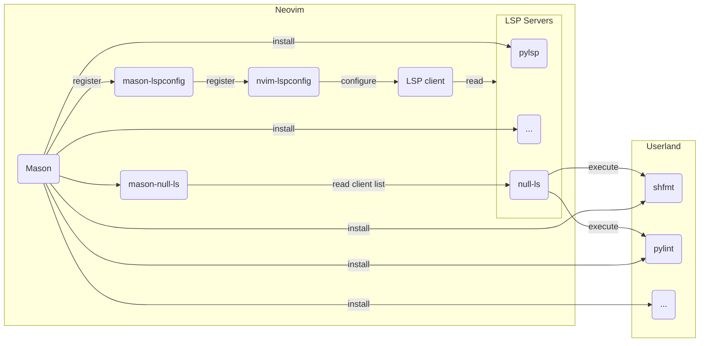

<p align="center">

</p>

## Abstract

To make the most of Neovim it's useful to understand the technologies it can leverage,
how the various plugins that manage these technologies relate to one another, and how
they can be installed and configured. In this article, we'll attempt to untangle the
Neovim plugin spaghetti that turns Neovim into a more featureful modern editor.

This article is broken up into the following sections:

1. [Understanding the Technologies](#understanding-the-technologies)
2. [LSP Servers are Only Half the Picture](#lsp-servers-are-only-half-the-picture)
3. [Neovim Configuration Goals](#neovim-configuration-goals)
4. [Neovim Plugins which Solve Problems](#neovim-plugins-which-solve-problems)
5. [LunarVim - An IDE Layer with Sane Defaults](#lunarvim---an-ide-layer-with-sane-defaults)
6. [Adding Support for New Programming Languages](#adding-support-for-new-programming-languages)
7. [Keeping Everything Up-To-Date](#keeping-everything-up-to-date)
8. [Conclusion](#conclusion)

## [Understanding the Technologies](#understanding-the-technologies)

First lets understand the technologies that make up the core support for
the language-specific features of Neovim.

### [Treesitter](#treesitter)

Treesitter builds an internal graph representation of any code opened in the editor
which can then be used by plugins authors to write plugins and for better than normal
syntax highlighting.

The following screenshot shows syntax highlighting for a Terraform HCL file with and
without treesitter support.


### [Linters](#linters)

Linters check code for common problems and provide hints on how to correct any detected
issues.

This screenshot shows diagnostics/linting tips delivered via a python LSP server.


### [Formatters](#formatters)

Formatters format code to conform to a specific coding style, typically these run when
save-file is run.

This screenshot shows the previous code after formatting with the `black` formatter.


### [LSP](#lsp)

The Language Server Protocol was introduced to improve editor performance. Prior to LSP,
editors would have to execute binaries to do things like linting and formatting. With
the advent of the LSP, editors can get real-time feedback to the editor from a process
which runs in the background.

NeoVIM added LSP support in version `0.5.0` and describes it as follows:
> LSP facilitates features like go-to-definition, find-references, hover, completion,
> rename, format, refactor, etc., using semantic whole-project analysis (unlike ctags).

For each filetype opened, if configured correctly, Neovim's LSP client will connect to an
LSP server. Depending on the server, a number of features become available, for
example:
* completion
* linting
* formatting
* hover-signatures
* diagnostics

## [LSP Servers are Only Half the Picture](#lsp-servers-are-only-half-the-picture)

Not all LSP servers support all features and so it can be necessary to fall-back to
executing a program to perform some tasks, for example: linting, or formatting.

In practice this means it is can be necessary to separately configure the LSP client,
formatter(s), and a linter(s) for every language that may be edited with Neovim. This
can be complicated since it involves using multiple plugins to handle overlapping areas
of responsibility and since the Neovim landscape is relatively new and evolves quickly,
things change often which can often leave the configuration either broken, using
deprecated plugins, or out of date practices.

Next, we'll look at one way to try and ease the pain of handling what can end up being a
fairly complex system.

## [Neovim Configuration Goals](#neovim-configuration-goals)

First, let's set-out some goals:

* Understand the core plugins that handle adding language-specific features to Neovim,
  along with how to configure them
* Understand how to extend the base configuration with any additional plugins that we
  need
* Minimize the amount of configuration we have to maintain
* Ensure we have mechanisms to install and update our plugins and their external dependencies

## [Neovim Plugins which Solve Problems](#neovim-plugins-which-solve-problems)

Next, lets understand how the core-plugin management and configuration works. To begin, we'll
need to understand what the core plugins are and how they relate to one-another:

* [neovim/nvim-lspconfig](https://github.com/neovim/nvim-lspconfig) - configs to connect
  the built-in lsp client to lsp servers
* [jose-elias-alvarez/null-ls.nvim](https://github.com/jose-elias-alvarez/null-ls.nvim) - allow hooking standalone applications into Neovim via an LSP server proxy - this is
  used to, for example, hook programmes that are not LSP servers thmselves into the
  LSP client such as formatters, linters, etc.
* [jayp0521/mason-null-ls.nvim](https://github.com/jayp0521/mason-null-ls.nvim) - automatically
  install formatters/linters to be used by null-ls
* [williamboman/mason](https://github.com/williamboman/mason) - a plugin which can be
  used to install and manage LSP servers, DAP servers, linters, and formatters
* [williamboman/mason-lspconfig](https://github.com/williamboman/mason-lspconfig) - This
  bridges the gap between nvim-lspconfig and mason - registering
  LSP configs with neovim so the LSP client can connect to the servers



If this seems complicated and doesn't make a lot of sense, don't worry. Instead of
trying to manage all of these plugins ourselves we can lean on one of the available
community maintained systems that has all of these preconfigured and wired up out of the
box..

## [LunarVim - An IDE Layer with Sane Defaults](#lunarvim---an-ide-layer-with-sane-defaults)

LunarVim is described as "An IDE layer for Neovim with sane defaults. Completely free
and community driven.". LunarVIM adds a good set of default plugins to NeoVIM with
configurations that will suit most people, and more importantly, it comes with all the
essentials pre-configured - but also allows customisation
(enabling/disabling/configuration), and extension using additional plugins. Equally, if
preferred, it is possible to manually configure the aforementioned plugins, however, the
rest of thie article assumes that LunarVim is used.

To read more about what LunarVim includes, the default
plugin list can be found
[here](https://www.lunarvim.org/docs/plugins/core-plugins-list), along with a list of
extra plugins [here](https://www.lunarvim.org/docs/plugins/extra-plugins), and also the
default settings which can be found
[here](https://github.com/LunarVim/LunarVim/blob/master/lua/lvim/config/settings.lua).

To continue, start by installing LunarVim following the instructions [here](https://www.lunarvim.org/docs/installation).

Next we'll create some aliases for convenience and that by default allow us to open up multiple files in tabs:

```
alias vim="lvim -p"
alias vi=vim
```

All of the plugins in the above section are included in LunarVim, apart from `mason-null-ls`,
lets extend our configuration by adding it to `~/.config/lvim/config.lua`:

```lua
lvim.plugins = {
  -- automatically install all the formatters and linters specified by the following
  -- config options:
  -- * linters.setup
  -- * formatters.setup
  { "jayp0521/mason-null-ls.nvim",
    config = function()
      require "mason-null-ls".setup({
        automatic_installation = false,
        automatic_setup = true,
        ensure_installed = nil
      })
    end
  },
}
```

LunarVim is an excellent base system but in-order to really have a good experience we
need to understand how to customize it, configure it, and extend it, read on to find out
how.

## [Adding Support for New Programming Languages](#adding-support-for-new-programming-languages)

Although we're going to use LunarVim, it's still necessary to do some configuration
when we want to add support for a new language. The next sections explain how to add
language support to the various different systems Neovim utilises to add language
functions to the editor.

### [Language Server Protocol Servers (LSPs)](#language-server-protocol-servers-lsps)

To see a list of available LSP servers, run `:help lspconfig-all`.

Update `~/.config/lvim/config.lua` with a list of desired LSP Servers to install:
```lua
require("mason-lspconfig").setup({
  ensure_installed = {
    "awk_ls",
    "bashls",
    "cssls",
    "dockerls",
    "gopls",
    "gradle_ls",
    "grammarly",
    "graphql",
    "html",
    "jsonls",
    "tsserver",
    "sumneko_lua",
    "marksman",
    "pyright",
    "pylsp",
    "sqlls",
    "tailwindcss",
    "terraformls",
    "tflint",
    "vuels",
    "yamlls"
  }
})
```

It's also possible to use an interactive method:
```
# Show available language servers
:LspInstall <lsp-server>
# -or- to browse and install supported plugins (use g? to see controls)
:Mason
```

To check the state of the LSP client:
```
# Inspect which formatters and linters are attached to the buffer
:LspInfo
# -or-
:LvimInfo
```

To see the features of the LSP server, run: `:lua print(vim.inspect(vim.lsp.protocol.make_client_capabilities()))`
```
{
  callHierarchy = {
    dynamicRegistration = false
  },
  textDocument = {
    codeAction = {
      codeActionLiteralSupport = {
        codeActionKind = {
          valueSet = { "", "quickfix", "refactor", "refactor.extract", "refactor.inline", "refactor.rewrite", "source", "source.organizeImports" }
        }
      }
    }
  }
  ...
}
```

### [Treesitter](#treesitter-1)

To see a list of available languages:
```
:TSInstallInfo
```

Add any languages to include Treesitter support for in `~/.config/lvim/config.lua`:
```lua
lvim.builtin.treesitter.ensure_installed = {
  "bash",
  "c",
  "javascript",
  "json",
  "lua",
  "python",
  "typescript",
  "tsx",
  "css",
  "rust",
  "java",
  "yaml",
  "go",
  "hcl",
  "markdown"
}
```

Once updated, run `:PackerCompile` and restart the editor.

Or interactively:
```
:TSInstall <filetype>
```

### [Optional Formatter(s)](#optional-formatters)

If there is no LSP server for the language, or the LSP server doesn't support a
formatter then it's possible to configure an external program to perform the formatting
via the `null-ls` plugin.

To see supported formatters, run: `:NullLsInfo`.

Optionally configure additional formatters in `~/.config/lvim/config.lua`:
```lua
-- set a formatter, this will override the language server formatting capabilities (if it exists)
local formatters = require "lvim.lsp.null-ls.formatters"
formatters.setup {
  { command = "black", filetypes = { "python" } },
  { command = "isort", filetypes = { "python" } },
  { command = "shfmt", filetypes = { "sh" } },
  { command = "terraform_fmt", filtypes = { "terraform" } },
  { command = "prettier", filetypes = { "typescript", "typescriptreact" }, },
}
```

Once added here, run: `:PackerCompile` and restart the editor. It is possible to check
the formatters have been installed by running `:Mason`.

### [Optional Linter(s)](#optional-linters)

If there is no LSP server for the language, or the LSP server doesn't support a linter
then it's possible to configure an external program to perform the linting via the
`null-ls` plugin.

To see supported linters (diagnostics), run: `:NullLsInfo`.

Optionally configure additional linters in `~/.config/lvim/config.lua`:
```lua
local linters = require "lvim.lsp.null-ls.linters"
linters.setup {
  { command = "flake8", filetypes = { "python" } },
  { command = "shellcheck", extra_args = { "--severity", "warning" }, },
  { command = "codespell", filetypes = { "javascript", "python" }, },
}
```

Once added here, run: `:PackerCompile` and restart the editor. It is possible to see
which formatters have been installed by running `:Mason`.

## [Keeping Everything Up-To-Date](#keeping-everything-up-to-date)

To update LunarVim itself:
```
:LvimUpdate
```

To update Neovim plugins
```
:PackerSync
```

To update Treesitter parsers
```
:TSUpdate
```

To update formatters/linters/LSPs, etc.:
```
# followed by "U" to Update All
:Mason
```


## [Conclusion](#conclusion)

Hopefully this article has helped explain how to establish a solid base system for
Neovim using LunarVim, how the core components work together, how to configure and
extend them to support new languages that you'd like to work with, along with how to
keep everything up-to-date!

Check out my Neovim/LunarVim config [here](https://github.com/roobert/dotfiles/blob/master/.config/lvim/config.lua) and my theme [here](https://github.com/roobert/nightshift.vim).
